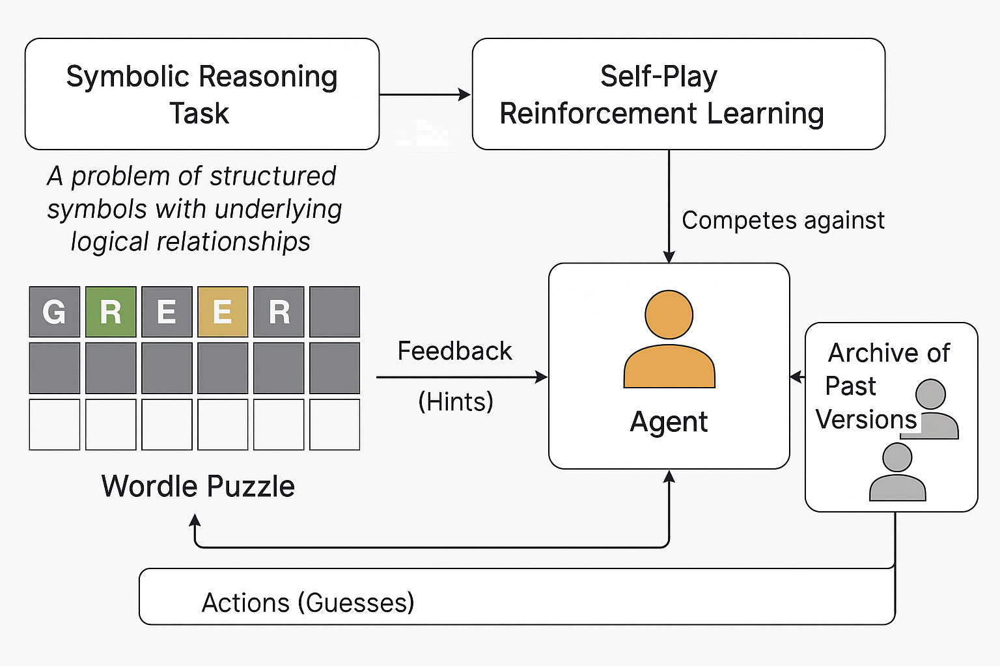

# Self-Play Reinforcement Learning for Symbolic Sequence Inference via Competitive Agent Evaluation


This repository contains an implementation of reinforcement learning agents developed for solving complex decision-making tasks. 

## Our Work
This project explores **symbolic reasoning in combinatorial spaces** using a **self-play reinforcement learning framework,** inspired by core principles of the *EvoPlay* approach presented in the [article](https://www.nature.com/articles/s42256-023-00691-9): "Self-play reinforcement learning guides protein engineering"

We investigate whether methods developed for biological sequence optimization - such as those used in protein design, can be effectively transferred to symbolic tasks, like solving a Wordle game. At the heart of this project is a powerful analogy:

 **Wordle as symbolic protein design**:
 - Sequence-based
 - High-dimensional combinatorial space
 - Non-differentiable 

---

## Project Overview

-  **Domain**: Symbolic reasoning (Wordle)
-  **Inspired by**: EvoPlay from protein design
-  **Method**: Self-play reinforcement learning
-  **Objective**: Learn to solve Wordle puzzles more effectively than past agent versions
-  **Evaluation**: Compare performance with vs. without self-play across multiple training runs

---

## Architecture Summary

### Agent Training Loop
- Agent selects actions (letters) to form guesses
- Receives feedback in the form of colored hints
- Uses PPO architecture 
- Trained with reward shaped for entropy, accuracy, and solve time

### Self-Play Dynamics
- Maintains a pool of archived agent checkpoints
- Each generation competes against a random sample from the past
- Reward signal is relative: positive if current agent outperforms historical baseline

### No Self-Play (Baseline)
- Single-agent RL trained purely on environment reward
- No relative performance pressure

---

## Results 

| Method           | Success Rate | Steps To Solve | 
|------------------|--------------|----------------|
| No Self-Play     | 0.32         | 4.78           | 
| Self-Play        | 0.45         | 4.92           |

> Self-play agents demonstrated faster convergence, more efficient guessing strategies, and stronger generalization to out-of-distribution puzzles.
---

## Conclusions

- Demonstrates the viability of **self-play in symbolic domains**  
- Introduces a **Wordle RL environment** with full compatibility 
- Compares **learning dynamics with and without self-play**  
- Opens pathways for EvoPlay-style symbolic RL on real-world structured tasks 

---

## 🛠️ Getting Started

```bash
git clone https://github.com/TzaharAmit/RL_self_play.git
cd rl-wordle-selfplay
run wodle_agent.py
run wodle_agent_self_play.py

